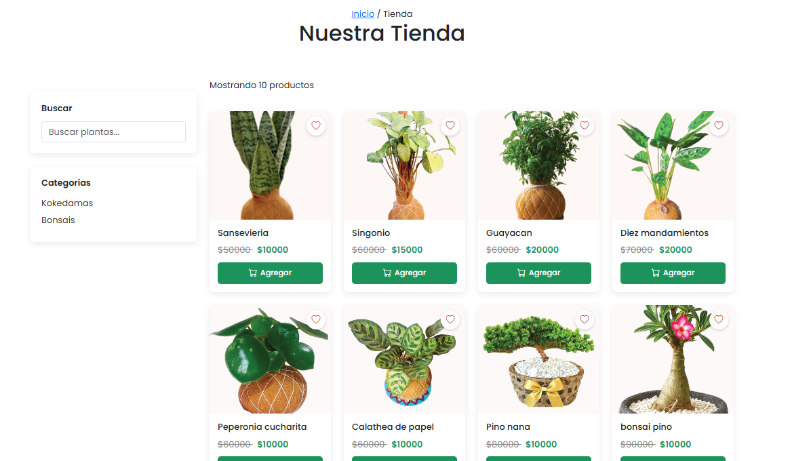
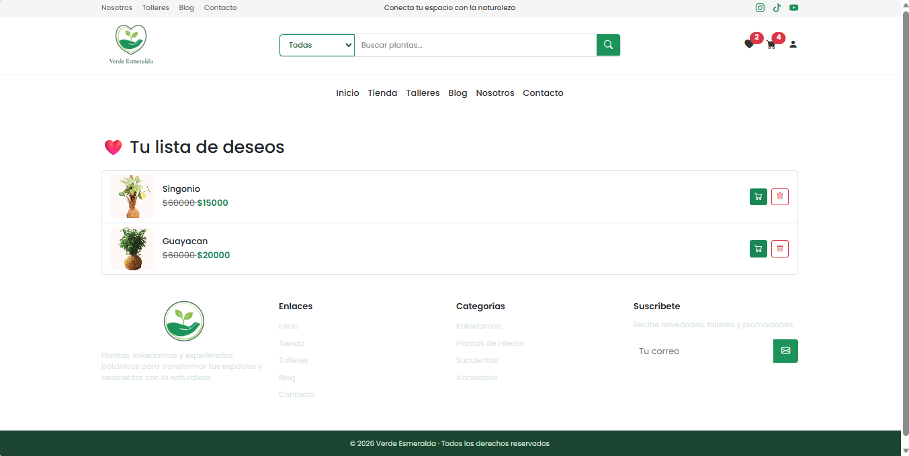
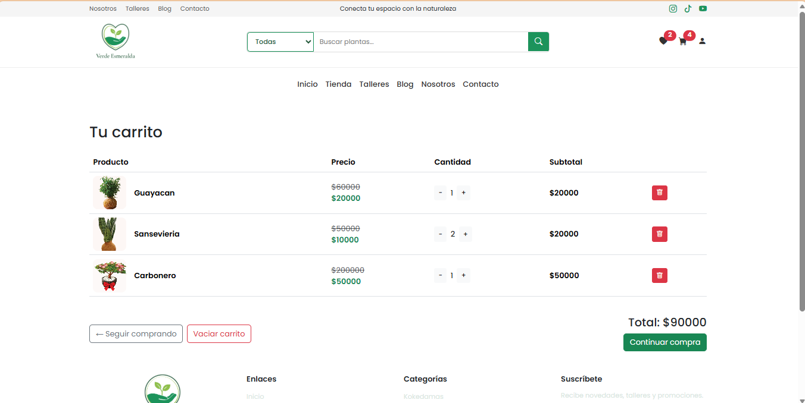
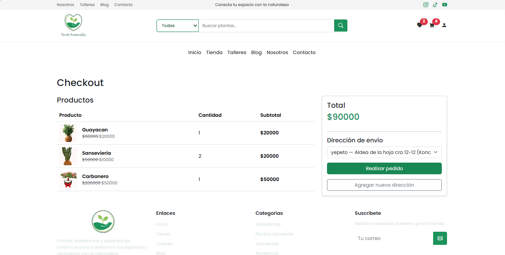
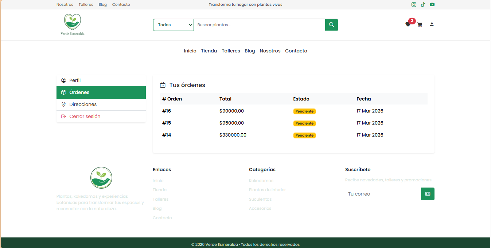
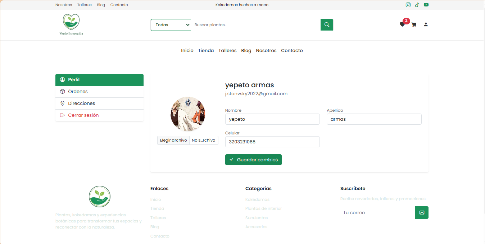
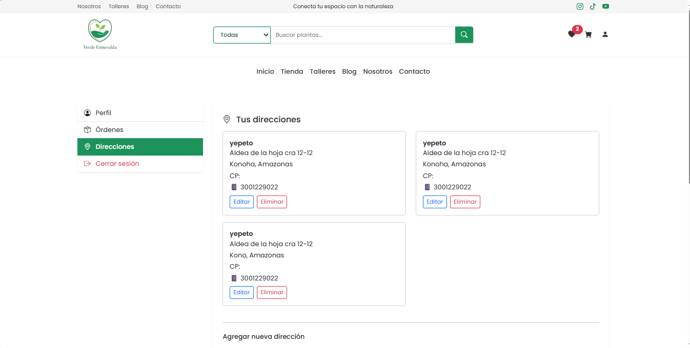

# Verde Esmeralda

Ecommerce desarrollado en Django enfocado en la venta de plantas de interior, kokedamas y productos botánicos. El proyecto implementa un flujo completo de compra con catálogo dinámico, carrito persistente, lista de deseos y sistema de autenticación de usuarios.

---

## Descripción

Verde Esmeralda es una aplicación web tipo ecommerce que permite a los usuarios explorar productos, agregarlos al carrito, guardarlos en una lista de deseos y completar un proceso de compra con direcciones de envío. Está diseñado con una estructura modular en Django y una interfaz moderna basada en Bootstrap.

---

## Características

- Catálogo de productos dinámico  
- Filtro por categorías  
- Búsqueda de productos  
- Carrito de compras persistente en base de datos  
- Lista de deseos (wishlist)  
- Sistema de autenticación de usuarios  
- Gestión de direcciones de envío  
- Proceso de checkout  
- Manejo de precios y descuentos  
- Múltiples imágenes por producto  
- Interfaz responsive  

---

## Tecnologías utilizadas

- Python  
- Django  
- Bootstrap 5  
- HTML5  
- CSS3  
- JavaScript  
- SQLite (entorno de desarrollo)  

---

## Estructura del proyecto

    verdeEsmeralda/
    │
    ├── productos/        # Catálogo de productos
    ├── carrito/          # Lógica del carrito
    ├── listaDeseos/      # Lista de deseos (wishlist)
    ├── usuarios/         # Autenticación y perfiles
    ├── templates/        # Plantillas HTML
    ├── static/           # Archivos estáticos (CSS, JS, imágenes)
    ├── manage.py

---

## Instalación

1. Clonar el repositorio:

    git clone https://github.com/TU-USUARIO/verde-esmeralda.git
    cd verde-esmeralda

2. Crear entorno virtual:

    python -m venv env

3. Activar entorno virtual:

   Linux/Mac:
    
    source env/bin/activate

   Windows:
    
    env\Scripts\activate

4. Instalar dependencias:

    pip install -r requirements.txt

5. Aplicar migraciones:

    python manage.py migrate

6. Crear superusuario (opcional):

    python manage.py createsuperuser

7. Ejecutar el servidor:

    python manage.py runserver

8. Acceder en el navegador:

    http://127.0.0.1:8000/

---

## Requerimientos

Si no tienes el archivo requirements.txt, puedes generarlo con:

    pip freeze > requirements.txt

Dependencias principales:

    Django>=4.2
    Pillow
    django-allauth

---

## Funcionalidades principales

### Carrito de compras
El carrito se almacena en base de datos y está asociado al usuario autenticado, permitiendo persistencia entre sesiones.

### Lista de deseos (Wishlist)
Permite guardar productos y moverlos directamente al carrito.

### Checkout
El usuario puede seleccionar una dirección de envío previamente guardada y generar una orden.

---

## Capturas de pantalla

Crear una carpeta llamada screenshots en el repositorio y agregar imágenes del sistema.

Ejemplo:

## Capturas de pantalla

---

## Mejoras futuras

- Integración con pasarelas de pago  
- Sistema de órdenes y seguimiento  
- Reseñas de productos  
- Implementación de AJAX para mejorar la experiencia de usuario  
- Notificaciones  
- Panel administrativo personalizado  

---

## Autor

Carlos Forero  

---

## Licencia

Proyecto desarrollado con fines educativos y de portafolio.